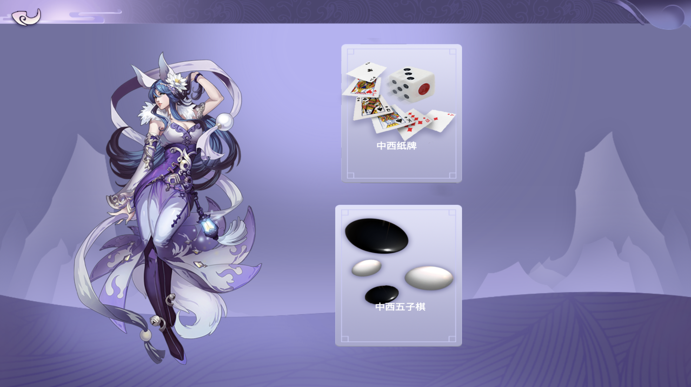

# 中西游戏

五子棋
        世界智力运动会竞技项目之一，是一种两人对弈的纯策略型棋类游戏，是世界智力运动会竞技项目之一，通常双方分别使用黑白两色的棋子，下在棋盘直线与横线的交叉点上，先形成5子连线者获胜。棋具与围棋通用，起源于中国上古时代的传统黑白棋种之一。主要流行于华人和汉字文化圈的国家以及欧美一些地区，是世界上最古老的棋。游戏容易上手，老少皆宜，而且趣味横生，引人入胜；不仅能增强思维能力，提高智力，而且富含哲理，有助于修身养性。

蜘蛛纸牌
        游戏开始时，发有十叠牌，每叠中只有一张正面朝上。其余的牌放在窗口右下角的五叠牌叠中；新一轮发牌时用这些牌。
        移牌的方法是将牌从一个牌叠拖到另一个牌叠。移牌的规则如下：
        可以将牌叠最底下的牌移到空牌叠。
        可以将牌从牌叠最底下移到牌值仅次于它的牌上，不论牌套或颜色如何。
        可以像对待一张牌一样移动一组同样牌套、依序排好的牌。
        准备新一轮发牌时，请单击“发牌”，或者单击窗口右下角的牌叠。
        在新一轮发牌之前，每一叠中都必须有牌。

联系我们:
- ljp30594@sina.com
